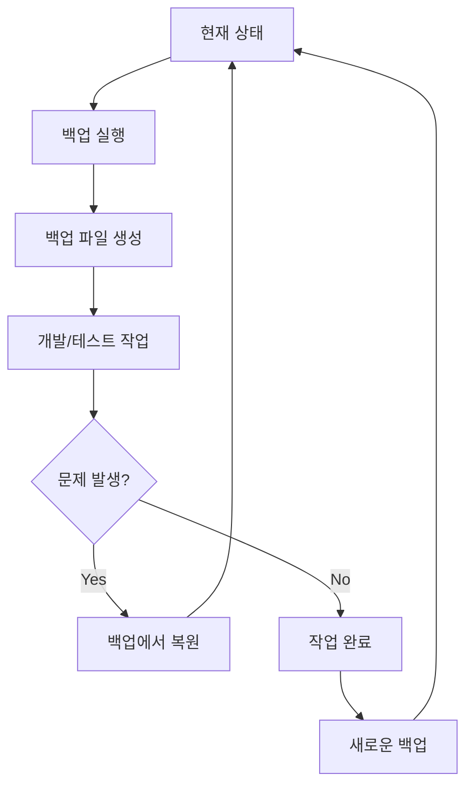

# QuizApp 백업 시스템 전체 개요

## 📋 개요

이 문서는 QuizApp 프로젝트의 전체 백업 시스템에 대한 개요를 제공합니다. 다양한 백업 방법과 스크립트를 통해 프로젝트의 데이터와 설정을 안전하게 보호할 수 있습니다.

## 🎯 백업 시스템 아키텍처

### 📊 백업 대상 데이터
- **데이터베이스**: PostgreSQL (1,183,619개 문제, 24,387개 시험, 220,387개 이미지)
- **마이그레이션**: Drizzle ORM 마이그레이션 파일 (7개)
- **스키마**: 데이터베이스 스키마 및 설정
- **환경설정**: `.env` 파일 및 Docker 설정
- **Predata**: HTML 파일 구조 및 마이그레이션 스크립트

### 🔧 백업 방법별 비교

| 방법 | 장점 | 단점 | 용도 |
|------|------|------|------|
| **Docker 볼륨** | 빠른 복원, 완벽한 데이터 보존 | 파일 크기 큼 | 전체 시스템 백업 |
| **SQL 덤프** | 표준 방식, 호환성 좋음 | 복원 시간 오래 | 데이터베이스만 백업 |
| **마이그레이션** | 구조적 백업, 버전 관리 | 데이터만 백업 | 개발 환경 백업 |

## 🚀 백업 스크립트 목록

### 1. Docker 볼륨 백업/복원
```bash
# 백업
./scripts/backup-restore-volume.sh backup

# 복원
./scripts/backup-restore-volume.sh restore [백업파일경로]
```

**특징:**
- PostgreSQL 데이터 파일 직접 백업
- 컨테이너 재빌드 후에도 데이터 완벽 복구
- 400MB 백업 파일로 전체 데이터 보존

### 2. Predata 마이그레이션 백업
```bash
# 빠른 백업
./scripts/quick-backup-predata.sh

# 상세 백업
./scripts/backup-predata-migration.sh [백업_이름]

# 복원
./scripts/restore-predata-migration.sh [백업_디렉토리]
```

**특징:**
- 마이그레이션 완료 상태 완벽 보존
- SQL 덤프 + 마이그레이션 파일 + 스키마
- 1,183,619개 문제 데이터 보호

### 3. 범용 백업 스크립트
```bash
# 일반 데이터베이스 백업
./scripts/backup-database.sh [백업_이름]

# 빠른 백업
./scripts/quick-backup.sh

# 복원
./scripts/restore-database.sh [백업_디렉토리]
```

**특징:**
- 다양한 백업 옵션 제공
- 진행상태 추적 및 에러 로깅
- Docker 볼륨 백업 옵션 포함

## 📁 백업 파일 구조

### 전체 백업 디렉토리 구조
```
backups/
├── volumes/                           # Docker 볼륨 백업
│   ├── quizapp_db_data_dev_20250813_233630.tar.gz
│   └── volume_backup_info_20250813_233630.txt
├── predata_quick/                     # Predata 빠른 백업
│   └── predata_migration_quick_20250813_233630/
│       ├── database.sql
│       ├── drizzle/
│       └── backup_info.txt
├── predata_migration/                 # Predata 상세 백업
│   └── predata_complete_backup_20250813_233630/
│       ├── full_database_20250813_233630.sql
│       ├── drizzle/
│       └── backup_info.txt
└── general/                           # 범용 백업
    └── manual_backup_20250813_233630/
        ├── database.sql
        ├── drizzle/
        └── backup_info.txt
```

## 🔄 백업/복원 워크플로우

### 기본 워크플로우


### 시나리오별 워크플로우

#### **시나리오 1: 개발 환경 백업**
```bash
# 1. 현재 상태 백업
./scripts/quick-backup-predata.sh

# 2. 개발 작업 진행
# ... 코드 수정, 테스트 등 ...

# 3. 문제 발생 시 복원
./scripts/restore-predata-migration.sh backups/predata_quick/predata_migration_quick_20250813_233630
```

#### **시나리오 2: 시스템 재빌드**
```bash
# 1. 현재 상태 백업
./scripts/backup-restore-volume.sh backup

# 2. 시스템 재빌드
docker-compose -f docker-compose.dev.yml down
docker-compose -f docker-compose.dev.yml up -d --build

# 3. 백업된 데이터 복원
./scripts/backup-restore-volume.sh restore backups/volumes/quizapp_db_data_dev_20250813_233630.tar.gz
```

#### **시나리오 3: 프로덕션 배포**
```bash
# 1. 개발 환경에서 백업
./scripts/backup-predata-migration.sh "production_deployment"

# 2. 프로덕션 서버에 백업 파일 전송
scp -r backups/predata_migration/production_deployment_20250813_233630/ user@prod-server:/backups/

# 3. 프로덕션에서 복원
./scripts/restore-predata-migration.sh /backups/production_deployment_20250813_233630
```

## 📈 백업 전략 및 모니터링

### 백업 전략

#### **계층적 백업**
1. **일일 백업**: 빠른 백업으로 최신 상태 보존
2. **주간 백업**: 상세 백업으로 전체 시스템 보존
3. **월간 백업**: Docker 볼륨 백업으로 완벽한 복구 보장

#### **백업 보존 정책**
```bash
# 30일 이상 된 백업 파일 자동 삭제
find backups/ -type d -mtime +30 -exec rm -rf {} \;

# 백업 디렉토리 크기 모니터링
du -sh backups/*/
```

### 모니터링

#### **Cron 작업 설정**
```bash
# crontab 편집
crontab -e

# 매일 새벽 2시에 빠른 백업
0 2 * * * cd /home/guri/develop/quizapp && ./scripts/quick-backup-predata.sh

# 매주 일요일 새벽 3시에 상세 백업
0 3 * * 0 cd /home/guri/develop/quizapp && ./scripts/backup-predata-migration.sh "weekly_backup"

# 매월 첫째 주 일요일 새벽 4시에 볼륨 백업
0 4 1-7 * 0 cd /home/guri/develop/quizapp && ./scripts/backup-restore-volume.sh backup
```

#### **백업 상태 모니터링**
```bash
# 백업 파일 수 확인
find backups/ -name "*.tar.gz" | wc -l
find backups/ -name "*.sql" | wc -l

# 최신 백업 시간 확인
ls -la backups/*/ | grep "$(date +%Y%m%d)"

# 백업 크기 모니터링
du -sh backups/*/ | sort -hr
```

## 🛠️ 문제 해결 및 유지보수

### 일반적인 문제들

#### **1. 권한 문제**
```bash
# Docker 소켓 접근 권한 오류
sudo docker exec quizapp-db-dev psql -U postgres -d quizapp -c "SELECT 1"

# 사용자를 docker 그룹에 추가
sudo usermod -aG docker $USER
newgrp docker
```

#### **2. 백업 파일 무결성 확인**
```bash
# tar 파일 내용 확인
tar -tzf backups/volumes/quizapp_db_data_dev_*.tar.gz | head -20

# SQL 파일 내용 확인
head -20 backups/predata_quick/*/database.sql

# 백업 정보 확인
cat backups/*/backup_info.txt
```

#### **3. 복원 후 데이터 검증**
```bash
# 데이터베이스 연결 테스트
sudo docker exec quizapp-db-dev psql -U postgres -d quizapp -c "SELECT COUNT(*) FROM questions;"

# 마이그레이션 상태 확인
sudo docker exec quizapp-db-dev psql -U postgres -d quizapp -c "SELECT * FROM drizzle.__drizzle_migrations;"

# 컨테이너 상태 확인
docker-compose -f docker-compose.dev.yml ps
```

### 백업 최적화

#### **압축 최적화**
```bash
# 더 높은 압축률 (시간은 더 오래 걸림)
sudo docker run --rm \
    -v quizapp_db_data_dev:/data \
    -v $(pwd)/backups:/backup \
    alpine tar cJf "/backup/quizapp_db_$(date +%Y%m%d_%H%M%S).tar.xz" -C /data .
```

#### **증분 백업 (고급)**
```bash
# rsync를 사용한 증분 백업
rsync -av --delete backups/ /mnt/backup_drive/quizapp_backups/
```

## 🔒 보안 및 백업 관리

### 보안 고려사항

#### **접근 권한 설정**
```bash
# 백업 디렉토리 권한 설정
chmod 700 backups/
chmod 600 backups/*/*.tar.gz
chmod 600 backups/*/*.sql
```

#### **백업 파일 암호화 (선택사항)**
```bash
# GPG로 백업 파일 암호화
gpg --encrypt --recipient your-email@example.com backups/volumes/quizapp_db_data_dev_*.tar.gz

# 암호화된 파일 복원
gpg --decrypt quizapp_db_data_dev_*.tar.gz.gpg | tar xzf -
```

### 백업 관리

#### **백업 정리**
```bash
# 오래된 백업 파일 정리
find backups/ -type d -mtime +30 -exec rm -rf {} \;
find backups/ -name "*.tar.gz" -mtime +30 -delete

# 백업 디렉토리 크기 모니터링
du -sh backups/*/ | sort -hr
```

#### **백업 로그 관리**
```bash
# 백업 실행 로그 생성
./scripts/backup-restore-volume.sh backup 2>&1 | tee backup_$(date +%Y%m%d_%H%M%S).log

# 로그 파일 정리
find . -name "backup_*.log" -mtime +7 -delete
```

## 📚 관련 문서 및 리소스

### 프로젝트 내 문서
- [Docker 볼륨 백업/복원 가이드](./DOCKER_VOLUME_BACKUP_RESTORE.md)
- [Predata 마이그레이션 백업 가이드](./PREDATA_MIGRATION_BACKUP.md)
- [QuizApp 마이그레이션 가이드](./MIGRATION_GUIDE.md)

### 외부 리소스
- [Docker 볼륨 관리 공식 문서](https://docs.docker.com/storage/volumes/)
- [PostgreSQL 백업/복원 가이드](https://www.postgresql.org/docs/current/backup.html)
- [Drizzle ORM 공식 문서](https://orm.drizzle.team/)

### 유용한 명령어 모음
```bash
# 전체 백업 상태 확인
ls -la backups/*/

# 백업 크기 통계
du -sh backups/*/ | sort -hr

# 최신 백업 확인
find backups/ -type d -name "*$(date +%Y%m%d)*" -exec ls -la {} \;

# 백업 파일 검색
find backups/ -name "*.tar.gz" -o -name "*.sql" | head -10
```

## 🎯 결론

QuizApp 백업 시스템은 다양한 백업 방법과 자동화된 스크립트를 통해 프로젝트의 데이터를 안전하게 보호합니다.

**핵심 특징:**
- ✅ **다양한 백업 방법**: Docker 볼륨, SQL 덤프, 마이그레이션 백업
- ✅ **자동화된 스크립트**: 백업부터 복원까지 원클릭 실행
- ✅ **완벽한 데이터 보존**: 1,183,619개 문제 데이터 완벽 보호
- ✅ **유연한 복원 옵션**: 상황에 맞는 최적의 복원 방법 선택
- ✅ **정기 백업 지원**: Cron을 통한 자동 백업 스케줄링

정기적인 백업을 통해 데이터 손실 위험을 최소화하고, 언제든지 안전하게 시스템을 복구할 수 있습니다.

