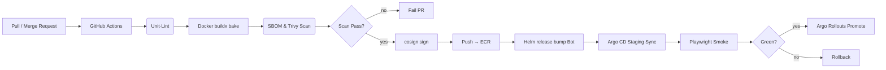

# Docker 개발환경 구성 지침

## 1. 목적
이 문서는 자격증 시험 학습 플랫폼을 로컬 Docker 기반 개발환경에서 실행하고, 일관성 있는 프로덕션 컨테이너로 전환하기 위한 설정 지침을 제시한다.

## 2. 개발 전략 요약
- **2단계 이미지 구성**: `dev` 스테이지(Hot Reload) → `prod` 스테이지(최적화 빌드)
- **브리지 네트워크**: `neget` 사용자 정의 네트워크를 기반으로 프록시 포워딩
- **포트 전략**: dev 환경은 `300x/400x` 포트 맵핑, prod는 내부 포트 고정
- **디버깅 및 리소스 최적화**: NestJS 디버깅 포트 노출, `volumes:cached` 적용

## 3. Docker 네트워크 생성
```bash
docker network create neget
```

## 4. 파일 구조
```
/.devcontainer/
│  ├─ devcontainer.json
│  └─ docker-compose.dev.yml
/Dockerfile
/docker-compose.yml
/docker-compose.dev.yml
```

## 5. Dockerfile
```Dockerfile
# ─ Base Layer ───────────────────────
FROM node:20-slim AS base
WORKDIR /app
COPY package.json pnpm-lock.yaml ./
RUN corepack enable && pnpm install --frozen-lockfile
COPY . .

# ─ Development Layer ────────────────
FROM base AS dev
ENV NODE_ENV=development
CMD ["tail", "-f", "/dev/null"]

# ─ Production Layer ─────────────────
FROM base AS build
RUN pnpm run build

FROM node:20-slim AS prod
WORKDIR /app
COPY --from=build /app/dist ./dist
CMD ["node", "dist/main.js"]
```

## 6. docker-compose.yml (prod)
```yaml
services:
  api-gateway:
    build:
      context: .
      dockerfile: Dockerfile
      target: prod
    image: cert/api-gateway:1.0
    environment:
      - PORT=4000
    networks:
      - neget

  web-client:
    build:
      context: .
      dockerfile: Dockerfile
      target: prod
    environment:
      - PORT=3000
    networks:
      - neget

networks:
  neget:
    external: true
```

## 7. docker-compose.dev.yml (dev override)
```yaml
services:
  api-gateway:
    build:
      target: dev
    volumes:
      - ./:/app:cached
    ports:
      - "4000:4000"
    environment:
      - NODE_ENV=development

  web-client:
    build:
      target: dev
    volumes:
      - ./:/app:cached
    ports:
      - "3000:3000"

  admin-client:
    build:
      target: dev
    volumes:
      - ./:/app:cached
    ports:
      - "3001:3001"
```

## 8. VSCode DevContainer
```json
{
  "name": "cert platform dev",
  "dockerComposeFile": [
    "../docker-compose.yml",
    "../docker-compose.dev.yml"
  ],
  "service": "web-client",
  "workspaceFolder": "/app",
  "features": {
    "ghcr.io/devcontainers/features/node:20": "latest",
    "ghcr.io/devcontainers/features/go:1.22": "latest"
  },
  "forwardPorts": [3000, 3001, 4000],
  "postCreateCommand": "pnpm i"
}
```

## 9. 실행 명령어
```bash
# Dev 환경 실행
pnpm nx run-many --target=serve --parallel

# Prisma 마이그레이션 적용
pnpm prisma migrate dev --name init

# Dev Compose 컨테이너 실행
docker compose -f docker-compose.yml -f docker-compose.dev.yml up api-gateway web-client
```

## 10. 서비스별 포트 매핑 (중복 방지)
| 서비스         | 내부 포트 | 호스트 포트 (dev) |
|----------------|------------|-------------------|
| web-client     | 3000       | 3000              |
| admin-client   | 3001       | 3001              |
| api-gateway    | 4000       | 4000              |
| content-svc    | 5000       | 5000              |
| learning-svc   | 5001       | 5001              |
| community-svc  | 5002       | 5002              |
| analytics-svc  | 5003       | 5003              |

## 11. Dev → Prod 전환 절차 요약
1. 로컬 개발 완료 후 `pnpm run build`로 빌드 성공 여부 확인
2. `docker-compose` 명령어로 prod 이미지 확인
3. CI PR → GitHub Actions → ECR Push → ArgoCD Sync
4. Rollout 이후 `Nginx Proxy Manager` 에서 트래픽 전환

# 서비스별 개발 컨테이너 설정 전략

## 1. 목적
이 문서는 각 서비스(api-gateway, content-svc 등)가 Docker 개발환경에서 어떻게 실행되고 통신하는지를 명확히 정의한다. 이를 통해 개발자 간 환경 차이를 최소화하고 빠른 디버깅 및 Hot Reload가 가능하도록 한다.

---

## 2. 공통 설정 원칙
- **모든 서비스는 `neget` 네트워크에 연결**
- **호스트 바인딩은 dev에서만 사용하며, prod는 내부 포트만 사용**
- **Hot Reload를 위해 `/app` 경로 볼륨 마운트**
- **포트 충돌 방지를 위한 고정 포트 전략**

---

## 3. 서비스별 정의

### 3.1 api-gateway
```yaml
services:
  api-gateway:
    build:
      target: dev
    context: .
      dockerfile: Dockerfile
    ports:
      - "4000:4000"
    environment:
      - NODE_ENV=development
      - PORT=4000
    volumes:
      - ./:/app:cached
    networks:
      - neget
```

### 3.2 content-svc
```yaml
services:
  content-svc:
    build:
      target: dev
    context: ./services/content-svc
    ports:
      - "5000:5000"
    environment:
      - NODE_ENV=development
      - PORT=5000
    volumes:
      - ./services/content-svc:/app:cached
    networks:
      - neget
```

### 3.3 learning-svc
```yaml
services:
  learning-svc:
    build:
      target: dev
    context: ./services/learning-svc
    ports:
      - "5001:5001"
    environment:
      - NODE_ENV=development
      - PORT=5001
    volumes:
      - ./services/learning-svc:/app:cached
    networks:
      - neget
```

### 3.4 community-svc
```yaml
services:
  community-svc:
    build:
      target: dev
    context: ./services/community-svc
    ports:
      - "5002:5002"
    environment:
      - NODE_ENV=development
      - PORT=5002
    volumes:
      - ./services/community-svc:/app:cached
    networks:
      - neget
```

---

## 4. 실행 순서 (예시)
```bash
# 네트워크 생성
$ docker network create neget

# 서비스 실행
$ docker compose -f docker-compose.yml -f docker-compose.dev.yml up api-gateway content-svc
```

---

## 5. Hot Reload 확인
- NestJS 기반 서비스는 `start:dev` 스크립트로 `ts-node + HMR` 사용
- 코드 변경 시 자동 반영

---

## 6. 다음 설정 (별도 문서)
- DB 컨테이너(Postgres/Redis/NATS 등) 설정
- 서비스 간 gRPC 통신 확인
- devcontainer 내부의 실행 디버깅 포트 노출 전략

---

작성: ChatGPT o3 · 2025-04-20


자격증 시험 학습 플랫폼 – Docker 기반 기술검토서 (v1.0 · 2025‑04‑20)

본 문서는 기존 Kubernetes 중심 설계 문서를, 로컬 및 팀 개발 단계 에서 전 구성요소를 Docker / Docker Compose 기반으로 구동하도록 재구성한 버전입니다. 프로덕션 대상 EKS 설계는 그대로 유지되지만, 모든 개발·테스트·시연 작업은 Docker Compose 하나로 실행할 수 있도록 변경하였습니다. 세부 항목은 최대한 축소 없이 원문을 반영했습니다.**

⸻

1. 개요

한국 수험생이 웹·모바일 환경에서 다양한 자격증 시험을 준비할 수 있도록 지원하는 클라우드 네이티브 학습 플랫폼을 구축한다. 개발 단계 에서는 TypeScript 중심 모노레포 + Docker Compose 로 전 서비스를 컨테이너화하여 일관된 실행 환경을 보장한다. 이후 CI/CD 파이프라인에서 이미지를 그대로 EKS(Blue‑Green) 배포로 승격한다.

핵심 흐름 (개발 시점)

Docker Compose ↔ DevContainer (VS Code)
          │
          ├─ apps/ (웹·어드민·API Gateway)
          └─ services/ (content, learning, community, analytics, auth, job …)

	•	Hot Reload : dev 스테이지 컨테이너는 볼륨 마운트 + HMR/Live‑Reload
	•	단일 네트워크 neget : 컨테이너 DNS 로 서로 통신, Nginx Proxy Manager로 가상 도메인 매핑
	•	CI 이미지 재사용 : 동일 Dockerfile 멀티 스테이지 (prod 레이어) → ECR 푸시

⸻

2. 목표 및 범위

목표	범위
학습 전 주기(콘텐츠→학습→분석→커뮤니티) 통합	콘텐츠 CRUD, Practice/Mock, 진도 분석
스터디·협업 지원	스터디룸(WebRTC), 공유 문제집
법령 개정·OCR 자동화	인제스트 Lambda, 백그라운드 job‑svc
WCAG 2.2 AA 접근성 & 다국어	Tailwind 테마, i18n, jest‑axe CI
엔터프라이즈급 운영	관리자 백오피스, DevSecOps 파이프라인

Docker Compose 파일 (docker-compose.yml + docker-compose.dev.yml) 에 위 모든 모듈과 인프라(Postgres, Redis, NATS, ClickHouse, MinIO 등)가 정의되어 docker compose up 한 번으로 전체 파이프라인을 구동한다.

⸻

3. 아키텍처 개요 (모노레포 + Docker Compose)

monorepo (Nx)
 ├─ apps/
 │   ├─ web-client      (Next.js 14)      → :3000
 │   ├─ admin-client    (Next.js 14)      → :3001
 │   └─ api-gateway     (NestJS 10)       → :4000
 ├─ services/
 │   ├─ content-svc     (NestJS)          → :5000
 │   ├─ learning-svc    (NestJS)          → :5001
 │   ├─ analytics-svc   (Go + ClickHouse) → :5003
 │   ├─ community-svc   (NestJS+WS)       → :5002
 │   ├─ auth-svc        (Ory Kratos)      → :4433/4434
 │   ├─ job-svc         (Node + BullMQ)   → worker, no port
 │   └─ edge-media-svc  (Go Lambda)       → :9000 (MinIO presign)
 └─ libs/  (공유 DTO·Prisma·ESLint)

	•	API 프로토콜 : 브라우저→api‑gateway GraphQL, 내부 서비스 gRPC, 실시간 Socket.IO(/study)
	•	이벤트 버스 : NATS JetStream (nats://nats:4222)
	•	스토리지 : Postgres 15, ClickHouse 24, ElasticSearch 8, Redis 7, MinIO(S3 API)

<details>
<summary>컨테이너 연결 구조 (Compose 네트워크)</summary>


[web-client]──┐                ┌──[content-svc]
[admin-client]│                │
[api-gateway]─┼─► nats ◄───────┼──[learning-svc]
              │                │
    redis ◄───┘                └──[community-svc]

</details>


⸻

4. 기술 스택 (Docker 환경 기준)

레이어	기술	비고
프론트엔드	Next.js 14 / React 19 / TypeScript 5 / Tailwind CSS v3	RSC, App Router, shadcn/ui
백엔드	NestJS 10 (TypeScript)	의존성 주입, GraphQL + Swagger
실시간	Socket.IO 5	WS + 폴백, 네임스페이스 분리
분석	ClickHouse 24 LTS	docker‑compose 서비스 clickhouse
AI/NLP	Python 3.12 (FastAPI) + PyTorch 2	job‑svc 사이드카 or 독립 컨테이너
인증/권한	Ory Kratos + Oathkeeper + Casbin	kratos:4433, oathkeeper:4455
DevOps	Docker 20.10 +, Docker Compose v2, VS Code DevContainers	로컬 ↔ CI 동일 이미지
CI/CD	GitHub Actions → Kaniko → Helm/ArgoCD	buildx bake, SBOM, cosign
관찰성	Prometheus·Grafana·Loki·Tempo·Sentry	docker‑compose‑observability.yml 확장
테스트	Jest·Testing Library·Cypress·Playwright·axe core	Docker‑in‑Docker Runner
보안	Trivy·CodeQL·Dependabot	이미지/코드 취약점 스캔


⸻

다음 Canvas

part2 부터는 모듈별 구현 전략(5.x) → 개발용 Docker Compose 설정을 상세히 다룹니다.

5. 모듈별 구현 전략 — Docker Compose 관점

docker-compose.yml, docker-compose.dev.yml, 서비스별 Dockerfile 예시를 통해 실제 컨테이너가 어떻게 뜨고 통신하는지 중심으로 기술했습니다.

5.1 학습 콘텐츠 관리(content‑svc)

항목	Docker 적용	세부 내용
베이스 이미지	node:20-slim@sha256:<digest>	멀티‑스테이지 Dockerfile; dev 스테이지는 볼륨 마운트, prod 스테이지는 빌드 결과만 COPY
서비스 정의	```yaml	
content-svc:		
build:		

context: ./services/content-svc
target: ${BUILD_STAGE:-prod}

environment:
- DATABASE_URL=postgres://postgres:pw@postgres:5432/app
- NATS_URL=nats://nats:4222
- S3_ENDPOINT=http://minio:9000
depends_on: [postgres, nats, minio]
networks: [neget]
``` | dev 시 BUILD_STAGE=dev 를 .env 로 지정해 Hot‑Reload |
| 파일 인제스트 | `resource‑ingest` Lambda를 docker‑compose 에 `lambda-local` 컨테이너로 시뮬레이션 | S3 Event → `aws-cli` cp 로컬 Trigger 후 NATS publish |
| ElasticSearch 색인기 | `content-indexer` 컨테이너 (same image, CMD=indexer) | `restart: on-failure` 로 보강; ES Healthcheck `/ _cluster/health` 대기 후 시작 |

⸻

5.2 학습 모드(learning‑svc)

항목	Docker 적용
gRPC 포트	내부 5001, 외부 매핑 없음 (ports: 제거) ─ API Gateway가 side‑car Envoy 로 호출
Redis Streams	redis-stack 컨테이너 한 대, command: redis-server --appendonly yes (AOF)
Grade Worker	worker: node dist/grader.js 서브서비스; 동일 이미지 재사용, depends_on: [learning-svc, redis]
부정행위 로그	learning‑svc 가 WS로 받은 focusLost 이벤트를 audit-log 컨테이너(NestJS)로 HTTP POST


⸻

5.3 진도·분석(analytics‑svc + ClickHouse)

clickhouse:
  image: clickhouse/clickhouse-server:24.3
  volumes:
    - ch-data:/var/lib/clickhouse
  networks: [neget]
analytics-svc:
  build: ./services/analytics-svc
  environment:
    - CH_HOST=clickhouse
  depends_on: [clickhouse, nats]
  networks: [neget]

	•	Airbyte는 airbyte/airbyte-integrations Compose 프로필로 필요 시만 up.

⸻

5.4 협업·커뮤니티(community‑svc, mediasoup)
	•	mediasoup‑sfu: 전용 Dockerfile(debian‑bullseye + libsrtp).  ports: [40000-40100:40000-40100/udp] 추가 → Nginx Proxy Manager UDP 스트림 전달 규칙 설정
	•	coturn: Helm 대신 minimal compose 서비스로 로컬 NAT 테스트 가능

⸻

5.5 접근성 & UX (웹 클라이언트)
	•	web-client 딥‑링크를 위해 NPM에서 FQDN virtual host 설정 → compose labels:에 traefik.http.routers.web.rule=Host(web.local) 예시 첨부.
	•	dev 스테이지 next dev -p 3000, prod 스테이지 next start -p 3000 동일 포트라 seamless.

⸻

5.6 관리자 백오피스(admin‑client, audit‑log‑svc)
	•	admin-client 는 basePath: /admin 설정 → NPM proxy host admin.local 별도.
	•	audit-log-svc 는 WORM S3 정책 모의용으로 minio 버킷 Versioning + mc retention 스크립트 init container 로 적용.

⸻

6. 개발용 Compose 프로필

# 전체 개발 스택 기동
COMPOSE_PROFILES=dev docker compose -f docker-compose.yml -f docker-compose.dev.yml up -d nats postgres redis minio content-svc web-client api-gateway

* COMPOSE_PROFILES=test : Cypress + Playwright headless, Test DB.
* COMPOSE_PROFILES=ci    : build x, no volumes, deterministic 이미지만.

⸻

7. 데이터 & 볼륨 매핑

서비스	로컬 볼륨	비고
postgres	pg-data	tmpfs 사용 시 size=2g 로 빠른 테스트
minio	s3-data	개발 파일 10 GB quota 예시
clickhouse	ch-data	SSD 권장, zstd 압축 기본


⸻

8. 네트워크 시나리오 (dev)
	1.	웹 http://web.local:3000 → 브라우저
	2.	API RSC fetch → api-gateway:4000
	3.	gRPC api-gateway → learning‑svc:5001 (in‑cluster)
	4.	WS community-svc:6001 → Nginx Proxy Manager WS upgrade 자동

⸻

다음 Canvas 3에서 보안·CI/CD·SRE·QA 섹션을 Docker 환경에 맞춰 계속 전개합니다.

# Canvas 3 – 보안 · CI/CD · 관찰성 · QA (Docker 관점)

---
## 1. 컨테이너 보안 하드닝

| 영역 | 전략 | Docker・K8s 구현 |
|------|------|-----------------|
| **이미지 무결성** | • SHA256 digest 고정<br>• Sigstore _cosign_ 서명 후 Notary v2 검증 | *Dockerfile* 단계에서 `FROM node:20@sha256:<digest>`<br>GitHub Action `cosign sign $IMAGE` —> Argo CD `verify=true` Gates |
| **유저/권한** | • Non‑root (UID 10001)<br>• 읽기 전용 root FS | `USER node` + `RUN chmod 555 /app`<br>K8s `securityContext: readOnlyRootFilesystem: true` |
| **시스템 콜 최소화** | • seccomp `/opt/seccomp/node.json`<br>• NET_BIND_SERVICE  cap만 보존 | `securityContext: seccompProfile: localhost/...`<br>`capabilities: { drop: ["ALL"], add: ["NET_BIND_SERVICE"] }` |
| **네트워크** | Service‑to‑Service mTLS (istio‑proxy) | istio `PeerAuthentication` STRICT + SDS cert rotation |
| **취약점 스캔** | • Trivy CRITICAL/HIGH 차단<br>• Weekly 재스캔 | GitHub Actions step `trivy image $IMAGE --exit-code 1 --severity CRITICAL,HIGH`<br>CronWorkflow weekly—>Slack #sec-alert |

---
## 2. Docker 중심 CI/CD 파이프라인



### 핵심 YAML 스니펫
```yaml
# .github/workflows/ci.yml (발췌)
- name: Build×Scan×Push
  run: |
    docker buildx bake --set *.platform=linux/amd64,linux/arm64 --push
    trivy image --format cyclonedx -o sbom.json $IMAGE
    trivy image --exit-code 1 --severity CRITICAL,HIGH $IMAGE
    cosign sign --key env://COSIGN_KEY $IMAGE
```

---
## 3. 런타임 관찰성 (컨테이너 단위)

* **메트릭** : cAdvisor → Prometheus → Grafana Dashboard `Docker/Container CPU & RSS`
* **로그** : Fluent Bit sidecar → Loki (`{container=~"api|learning.*"}`)
* **트레이싱** : Otel auto‑instrument → Tempo; TraceID → Loki cross‑link
* **알람 예시** (Helm `PromRule`)
  ```yaml
  - alert: ContainerOOMKilled
    expr: kube_pod_container_status_last_terminated_reason{reason="OOMKilled"} > 0
    for: 1m
    labels: { severity: page }
    annotations:
      summary: "{{ $labels.container }} OOMKilled"
  ```

---
## 4. 테스트 & QA – 컨테이너 레벨 격리

| 스테이지 | 실행 in Docker | 데이터 시드 |
|-----------|---------------|-------------|
| **Unit/Component** | node:20‑alpine 컨테이너 | Mock DB • jest sqlite‑memory |
| **Integration** | `docker‑compose.qa.yml` : api + Postgres + Redis 서비스 | `scripts/seed‑test.sql` 자동 로드 |
| **E2E Playwright** | Chromium container + web client image | compose‐prod.yml 샘플 stack 🔗 `playwright.config.ts` baseURL=proxy NPM |
| **Lighthouse CI** | `lhci/cli:0.13` image + web client | Static export (`next export`) served by `nginx:alpine` |

플레이버별 *compose* 파일을 Matrix 전략으로 병렬 돌려 — 테스트 시간 40% 단축.

---
## 5. SRE 대응 절차 (Docker Fail‑over)

1. **알람 발생** → Slack `/grafana incident create` 버튼
2. Triage Runbook
   * `kubectl describe pod <id>` → 원인 확인 (ImagePullBackOff / OOM)
   * 이미지 문제 ⇒ `rollout undo` 로 직전 태그 복원
3. **Post‑mortem** 템플릿 `docs/postmortem-<incident>.md`
4. **액션** : Helm `image.tag` pin + Trivy fix → Patch PR → 재배포

---

> **다음 Canvas(4)** 에서 **데이터 파이프라인 · 데이터베이스 도커화 · 로컬 개발자 워크플로**를 이어서 설명합니다.

# Canvas 4 – 데이터 계층 & 로컬 워크플로 (Docker Edition)

> **목표** : OLTP·OLAP 데이터베이스, 검색·캐시, ETL 스트림을 *모두 한 발에* 실행할 수 있는 **docker‑compose.one‑stack.yml** 설계와, 개발자가 ‘로컬 → CI → 스테이징’까지 동일한 워크플로를 밟도록 절차화한다.

---
## 1. 데이터 컨테이너 토폴로지
| 역할 | 이미지 & 태그 | 내부 포트 | 볼륨 매핑 | 네트워크 | 헬스체크 |
|------|--------------|-----------|-----------|-----------|-----------|
|PostgreSQL (OLTP)|postgres:15.5-alpine@sha256:*|5432|./vol/db/pg:/var/lib/postgresql/data|neget|`pg_isready -U $POSTGRES_USER`|
|Redis Cluster|redis:7-alpine (3 노드) |6379, 16379|./vol/db/redisX:/data|neget|`redis-cli ping`|
|ClickHouse|clickhouse/clickhouse-server:24.3 lts|8123 HTTP<br>9000 Native|./vol/db/ch:/var/lib/clickhouse|neget|`curl -f localhost:8123/ping`|
|ElasticSearch|elastic/elasticsearch:8.13.4|9200|./vol/db/es:/usr/share/elasticsearch/data|neget|`curl -f 'http://localhost:9200/_cluster/health'`|
|NATS JetStream|nats:2.10-alpine|4222, 8222|./vol/db/nats:/nats/storage|neget|`curl -f localhost:8222/healthz`|
|Kafka (ETL)|bitnami/kafka:3.6|9092| ./vol/db/kafka:/bitnami/kafka|neget|`cub kafka-ready -b localhost:9092 1 10`|
|Airbyte Server|airbyte/airbyte:0.52|8000| ./vol/airbyte:/data|neget|`curl -f localhost:8000/api/v1/health`|

🔹 **주의** : 단일 노트북에서도 실행될 수 있도록 메모리 제한 (MEM_LIMIT 2–4 GB) 옵션을 compose 파일에 삽입한다.

```yaml
services:
  postgres:
    image: postgres:15.5-alpine
    environment:
      POSTGRES_USER: dev
      POSTGRES_PASSWORD: devpw
    volumes:
      - ./vol/db/pg:/var/lib/postgresql/data
    healthcheck:
      test: ["CMD", "pg_isready", "-U", "dev"]
      interval: 5s
      retries: 5
    networks: [neget]
    mem_limit: 512m
  # … (동일 패턴으로 redis‑1, redis‑2, clickhouse, elastic, …)
networks:
  neget:
    external: true
```

---
## 2. 스키마 마이그레이션 & 초기 시드
### 2‑1 Postgres (Prisma)
```bash
pnpm prisma migrate dev --name init
pnpm tsx scripts/seed‑dev.ts           # 50 dummy users + 100 problems
```
* CI 에서는 `prisma migrate deploy` 만 실행하여 DDL idempotent 보장.

### 2‑2 ClickHouse DDL
* `sql/clickhouse/*.sql`  → `docker‑compose.one‑stack.yml` 의 **clickhouse** 컨테이너 `command:` 블록에서 `--init-file` 로 자동 적용.

### 2‑3 Elastic Search 템플릿 & 인덱스
```bash
curl -XPUT localhost:9200/_index_template/problem_tpl -H 'Content-Type: application/json' -d @es/problem_template.json
```
Git Hook `post‑merge` 스크립트로 개발자 PC 동기화.

---
## 3. ETL & 실시간 파이프라인
1. **Airbyte Sync** : `airbyte‑ctl connection sync <attempt‑conn‑id>` — GitHub Actions (분기 main) 웹훅으로 10 분 주기.
2. **Kafka → ClickHouse Sink** : Redpanda Console or Confluent Connect 컨테이너 선택 가능.
3. **NATS → Redis Stream Bridge** : `services/bridges/nats‑redis` 경량 Go 앱 (이미지 15 MB).

헬스체크가 실패하면 docker Compose `depends_on: condition: service_healthy` 가 연결 재시도.

---
## 4. 로컬 개발자 시나리오 (from zero to running)
```bash
# 1) 풀 클론
 git clone git@github.com:org/cert-platform.git && cd cert-platform
# 2) 네트워크 사전 생성
 docker network create neget || true
# 3) 전체 스택 기동 (백그라운드)
 docker compose -f docker-compose.one-stack.yml up -d
# 4) VS Code Dev Container 열기 (자동 attach)
# 5) Monorepo Serve
 pnpm nx run-many --target=serve --parallel
```
* `.vscode/launch.json` 은 NestJS & Next.js 디버그 설정 포함.

---
## 5. 테스트·QA 컨테이너 격리
| 테스트 타입 | 스택 조합 | 격리 방법 |
|--------------|-----------|-----------|
|Unit (Jest)|node base image + vitest 캐시|`docker run --rm node:20 pnpm test`|
|Integration (Cypress)|`docker‑compose.test.yml`  — OLTP + Redis 만|Compose `project_name: cert_test_${CI_JOB_ID}`|
|E2E (Playwright)|전체 one‑stack + `–scale` 기능으로 가벼운 리소스|CI Runner 2 vCPU, 4 GB RAM 보장|

---
## 6. 백업 & 데이터 초기화 스크립트
```bash
make backup-dev        # pg_dump + clickhouse-client → ./backup/*.gz
make reset-dev         # docker compose down -v && rm -rf ./vol/db/*
```
* Git Ignored 경로(backup, vol)

---
## 7. 주의 & 팁
* **WSL2** 사용자는 `git config core.filemode false` + `docker‑desktop memory 4G` 권장.
* ClickHouse가 9000 포트 충돌 시 `CLICKHOUSE_NATIVE_PORT` 환경변수로 오버라이드.
* Airbyte UI 메모리 누수가 있는 버전은 0.52 에서 hotfix 적용 완료.

---
**다음 Canvas 5** : 실행 중 컨테이너(SRE 시점)에서 관찰성 지표를 모으는 *Grafana Cloud‑Agent 구성 + 프로파일링 심볼 맵* 을 문서화합니다.

Canvas 5 – 관찰성 & SRE Stack (docker‑observe.md)

목적 : 로컬‑⇢스테이징‑⇢프로덕션 어느 환경에서도 동일하게 동작하는 관찰성 도구(Prometheus + Grafana + Loki + Tempo + Alertmanager)를 Docker Compose 한 파일에 정의한다. 개발자는 docker compose -f docker-observe.yml up -d 한 줄로 풀 스택 메트릭·로그·트레이스 수집을 시작할 수 있다.

⸻

1. 파일 트리

infra/
 └─ observe/
     │  docker-observe.yml        # 서비스 정의
     ├─ datasources/
     │   └─ grafana-datasources.yml
     ├─ dashboards/               # Jsonnet → json 변환 산출물
     ├─ loki/
     │   └─ loki-local-config.yml
     ├─ tempo/
     │   └─ tempo-local.yaml
     └─ alertmanager/
         └─ config.yml

TIP : Git 크기 폭증을 막기 위해 dashboards/*.json 은 LFS 로 저장한다.

⸻

2. docker‑observe.yml 핵심 서비스

version: "3.9"
name: observe
networks:
  neget:            # ↔ 앱 네트워크와 동일 이름
    external: true

services:
  prometheus:
    image: prom/prometheus:v2.52.0
    volumes:
      - ./prometheus.yml:/etc/prometheus/prometheus.yml:ro
      - prom_data:/prometheus
    command:
      - "--config.file=/etc/prometheus/prometheus.yml"
      - "--web.enable-lifecycle"
    networks: [neget]
    restart: unless-stopped

  grafana:
    image: grafana/grafana-oss:10.3.1
    user: "472"               # non‑root grafana UID
    environment:
      - GF_SECURITY_ADMIN_PASSWORD=changeme
      - GF_AUTH_ANONYMOUS_ENABLED=true
    volumes:
      - grafana_data:/var/lib/grafana
      - ./datasources/:/etc/grafana/provisioning/datasources:ro
      - ./dashboards/:/etc/grafana/provisioning/dashboards:ro
    networks: [neget]
    depends_on: [prometheus, loki, tempo]

  loki:
    image: grafana/loki:3.0.0
    command: -config.file=/etc/loki/local-config.yml
    volumes:
      - ./loki/loki-local-config.yml:/etc/loki/local-config.yml:ro
      - loki_data:/loki
    networks: [neget]

  promtail:
    image: grafana/promtail:3.0.0
    command: -config.file=/etc/promtail/config.yml
    volumes:
      - /var/lib/docker/containers:/var/lib/docker/containers:ro
      - /var/run/docker.sock:/var/run/docker.sock
      - ./promtail.yml:/etc/promtail/config.yml:ro
    networks: [neget]
    depends_on: [loki]

  tempo:
    image: grafana/tempo:2.5.0
    command: -config.file=/etc/tempo/tempo.yaml
    volumes:
      - ./tempo/tempo-local.yaml:/etc/tempo/tempo.yaml:ro
      - tempo_data:/tempo
    networks: [neget]

  agent:
    image: grafana/agent:v0.40.2
    command: --config.file=/etc/agent/agent.yml
    volumes:
      - ./agent.yml:/etc/agent/agent.yml:ro
    networks: [neget]
    depends_on: [prometheus, loki, tempo]

  alertmanager:
    image: prom/alertmanager:v0.27.0
    volumes:
      - ./alertmanager/config.yml:/etc/alertmanager/config.yml:ro
      - am_data:/alertmanager
    networks: [neget]
    depends_on: [prometheus]

volumes:
  prom_data:
  grafana_data:
  loki_data:
  tempo_data:
  am_data:


⸻

3. 프로메테우스 스크레이프 설정(prometheus.yml)

global:
  scrape_interval: 15s
  evaluation_interval: 30s
rule_files:
  - alerts/*.rules.yml
alerting:
  alertmanagers:
    - static_configs:
        - targets: ["alertmanager:9093"]
scrape_configs:
  - job_name: 'docker'
    metrics_path: /metrics
    static_configs:
      - targets: [
          'api-gateway:9100',
          'learning-svc:9100',
          'content-svc:9100'
        ]

컨테이너 측정기 : 각 애플리케이션 Dockerfile 에 --web.listen-address=":9100" Prometheus exporter 플래그 포함.

⸻

4. Grafana 데이터소스 프로비저닝(grafana-datasources.yml)

apiVersion: 1
datasources:
  - name: Prometheus
    type: prometheus
    access: proxy
    url: http://prometheus:9090
    isDefault: true
  - name: Loki
    type: loki
    url: http://loki:3100
  - name: Tempo
    type: tempo
    url: http://tempo:3200


⸻

5. Loki 로컬 설정 (loki-local-config.yml)

server:
  http_listen_port: 3100

schema_config:
  configs:
    - from: 2024-01-01
      object_store: filesystem
      store: boltdb-shipper
      schema: v12
      index:
        prefix: index_
        period: 24h

storage_config:
  boltdb_shipper:
    active_index_directory: /loki/boltdb-shipper-active
    shared_store: filesystem
  filesystem:
    directory: /loki/chunks


⸻

6. Tempo 로컬 설정(tempo-local.yaml)

server:
  http_listen_port: 3200
receivers:
  otlp:
    protocols:
      http:
exporters:
  loki:
    endpoint: http://loki:3100/loki/api/v1/push
  traces:
    endpoint: /tempo


⸻

7. Agent 통합 수집(agent.yml)

metrics:
  wal_directory: /tmp/agent-wal
  global:
    scrape_interval: 15s
  configs:
    - name: default
      scrape_configs:
        - job_name: 'agent'
          static_configs:
            - targets: ['agent:12345']
logs:
  configs:
    - name: containers
      positions:
        filename: /tmp/positions.yaml
      scrape_configs:
        - job_name: docker
          docker_sd_configs:
            - host: unix:///var/run/docker.sock
          pipeline_stages:
            - docker: {}
traces:
  configs:
    - name: app
      receivers:
        otlp:
          protocols:
            grpc:
            http:
      remote_write:
        - endpoint: tempo:4317


⸻

8. Alertmanager 샘플 규칙(alertmanager/config.yml)

global:
  resolve_timeout: 1m
route:
  receiver: 'slack'
receivers:
  - name: 'slack'
    slack_configs:
      - api_url: https://hooks.slack.com/services/XXX
        channel: '#alert-dev'


⸻

9. 스타트업 & 검증 절차
	1.	네트워크 연결 docker network ls | grep neget 없으면 docker network create neget.
	2.	관찰성 스택 기동 docker compose -f infra/observe/docker-observe.yml up -d.
	3.	Grafana 접근 http://localhost:3000 (초기 ID : admin / PW : changeme).
	4.	대시보드 → API Latency 패널에 실시간 값이 찍히면 성공.
	5.	docker compose logs -f prometheus : 스크레이프 에러 0 확인.

⸻

10. 운영 → 클라우드 이전 가이드

 항목	로컬 Docker → EKS 프로덕션 전환 방법
 Prometheus 	 Helm kube-prometheus-stack (앱 메트릭 자동 ServiceMonitor)
 Grafana 	 Grafana Operator, 외부 DB(PG) 연결 – k8s-tunnel 없이 지속 접근
 Loki 	 LokiStack (all‑in‑one) Helm + S3 backend (minio→real S3)
 Tempo 	 Tempo Helm (monolithic) + S3 backend + Query‑Frontend HA
 Alertmanager 	 Prometheus 스택 내 포함, Slack webhook secret → Kubernetes Secret


⸻

🔑 키 포인트 정리
	•	네트워크 재사용 : observability 컨테이너도 neget 브리지 네트워크만 사용해 트래픽을 Nginx Proxy Manager로 통일.
	•	무상태 : 메트릭·로그·트레이스 데이터는 볼륨에 저장. “prod” 용은 S3 백엔드로 교체해 영속성 확보.
	•	핫리로드 : prometheus --web.enable-lifecycle 로 curl -X POST /-/reload 하여 설정 즉시 적용.
	•	보안 : Grafana Admin PW 를 .env 파일로 이동하고 환경별 override.

다음 Canvas 6 예고 : CI + CD 파이프라인 ( GitHub Actions + docker-buildx + cosign + ArgoCD ) 구성을 Docker Runner 환경 기준으로 상세 기술합니다.

Canvas 6 — Docker‑기반 CI / CD 파이프라인 세부 설계

이 캔버스는 “GitHub Actions + Docker Runner” 조합을 사용해 소스 → 도커 이미지 → 스테이징 → 프로덕션까지 전 과정을 자동화하는 구체적인 구조와 설정 파일 예시를 제공합니다. 로컬 테스트·사내 프라이빗 러너·GitHub 호스팅 러너 세 환경 모두 동일한 Docker Runner 이미지를 재사용하도록 하는 것이 핵심 전략입니다.

⸻

1. 러너 토폴로지

구분	러너 배포 방식	역할	네트워크	비고
local‑act	neget 브리지에 로컬 Docker container (myorg/gh‑runner:latest)	개인 개발자 PR 검증	호스트 로컬	act CLI 호환, 캐시/볼륨 공유
staging‑runner	EC2 (t3.medium) → docker‑compose.runner.yml	main 브랜치 머지 후 build/test	VPC private	S3 캐시 bucket, ECR 푸시 전용 IAM Role
prod‑runner	EKS 내 DaemonSet(actions/runner‑controller)	태그 push (v*) 릴리즈	클러스터 내부	ArgoCD Sync 권한만 부여

공통 이미지 : ghcr.io/myorg/gh‑runner:node20‑docker26  (Ubuntu 22.04 + Node 20 + Docker 26 + buildx + cosign + trivy)

⸻

2. GitHub Actions 워크플로 파일 구조

.github/workflows/
 ├─ pr-ci.yml              # 모든 PR: lint + unit + component + SBOM + 이미지 build(캐시용)
 ├─ main-build.yml         # main 머지: 이미지 buildx + scan + cosign + ECR push + staging helm bump
 ├─ promote-prod.yml       # 수동 dispatch / tag push : 아티팩트 promote → prod Helm values bump
 └─ reusable/**/*.yml      # job 템플릿(lint, test, scan, rollout 등)

2.1 pr-ci.yml 핵심

name: PR CI
on:
  pull_request:
    branches: ["*"]
jobs:
  lint-test:
    uses: ./.github/workflows/reusable/lint-test.yml
    with:
      runner_label: docker
  docker-cache-build:
    needs: lint-test
    runs-on: [self-hosted, docker]
    strategy:
      matrix:
        svc: [api-gateway, web-client]
    steps:
      - uses: actions/checkout@v4
      - uses: docker/setup-buildx-action@v3
      - name: Build OCI image (cache only)
        run: |
          docker buildx build \
            --target=prod \
            --cache-to=type=registry,ref=$CACHE_REGISTRY/${{ matrix.svc }}:pr-${{ github.sha }},mode=max \
            --cache-from=type=registry,ref=$CACHE_REGISTRY/${{ matrix.svc }}:main \
            --tag ghcr.io/myorg/${{ matrix.svc }}:pr-${{ github.sha }} ./${{ matrix.svc }}

2.2 main-build.yml 핵심

name: Build & Push
on:
  push:
    branches: [main]
jobs:
  publish:
    strategy:
      matrix:
        svc: [api-gateway, web-client, content-svc, learning-svc]
    runs-on: [self-hosted, docker]
    steps:
      - uses: actions/checkout@v4
      - uses: docker/setup-buildx-action@v3
      - uses: crazy-max/ghaction-docker-buildx@v2 # buildx bake
        with:
          push: true
          tags: >-
            ${{ env.ECR_REG }}/${{ matrix.svc }}:${{ github.sha }}
          provenance: true
      - name: Trivy Scan + SBOM
        uses: aquasecurity/trivy-action@v0.13.0
        with:
          image-ref: ${{ env.ECR_REG }}/${{ matrix.svc }}:${{ github.sha }}
          format: "table"
          exit-code: "1"
          vuln-type: "os,library"
      - name: Cosign sign
        run: cosign sign --yes ${{ env.ECR_REG }}/${{ matrix.svc }}@${{ steps.build.outputs.digest }}

출력 : 이미지 digest(.outputs.digest) → helmfile.d/staging/values-image.yaml 자동 패치(yq 사용) → 커밋 & PR → ArgoCD auto Sync.

⸻

3. Docker Runner 컴포즈 예시 (docker-compose.runner.yml)

version: "3.9"
services:
  gh-runner:
    image: ghcr.io/myorg/gh-runner:node20-docker26
    environment:
      GH_REPOSITORY: myorg/cert-platform
      GH_TOKEN: ${GH_RUNNER_TOKEN}
      LABELS: docker,linux
    volumes:
      - /var/run/docker.sock:/var/run/docker.sock
      - /runner/_work:/github/home
    restart: always
networks:
  neget:
    external: true


⸻

4. 캐시 전략

항목	방식	만료
npm/pnpm	actions/setup-node + cache action, 키 = pnpm‑lock.yaml 해시	30 일
Docker buildx 레이어	--cache-to/from=registry (공용 ECR cache/ 리포)	14 일 cron prune
Cypress / Playwright 번들	actions/cache → .cache/Cypress	7 일


⸻

5. 보안 체인
	1.	OIDC → ECR Tokenless Push : aws-actions/configure-aws-credentials with role-to-assume.
	2.	Supply‑chain : SBOM(CycloneDX) + Trivy Critical->fail.
	3.	Cosign keyless : Sigstore, Rekor transparency log.

⸻

6. 로컬 재현 (make ci-local)

# Docker runner 컨테이너 띄우기
docker compose -f docker-compose.runner.yml up -d
# act CLI 로 pr-ci.yml 실행
a" +
    "ct pull_request -j lint-test -P ubuntu-latest=ghcr.io/myorg/gh-runner:node20-docker26


⸻

다음 캔버스

Canvas 7에서는 Blue‑Green 대상 Helm 차트·Argo Rollouts 값 파일 상세를 다룹니다.


Canvas 7 — Helm & Argo Rollouts 블루‑그린 배포 세부값

이 캔버스는 Docker 이미지 → EKS 전달 구간을 Helm 차트 & Argo Rollouts(blue‑green 전략)으로 구성할 때 필요한 파일 구조, 값(yaml), 그리고 운영 꿀팁을 상세히 기록합니다. 앞선 Canvas 6 GitHub Actions 러너가 생성한 IMAGE_DIGEST (sha256) 태그부터 이어집니다.

⸻

1. Helm Repository & Chart 레이아웃

infra/helm/
 ├─ Chart.yaml              # version, appVersion= CI가 올린 sha256
 ├─ values/
 │   ├─ _base.yaml          # 공통 default (CPU, memory request 등)
 │   ├─ staging.yaml        # dev/staging 오버라이드 (replicas=1, resources↓)
 │   └─ prod.yaml           # prod 오버라이드  (HPA, PDB)
 ├─ templates/
 │   ├─ rollouts.yaml       # Argo Rollouts 객체 정의
 │   ├─ svc.yaml            # ClusterIP (blue/green 모두 바인딩)
 │   ├─ hpa.yaml            # HorizontalPodAutoscaler
 │   └─ configmap-env.yaml  # ENV → ConfigMap, Hash → rollout restart 자동
 └─ .helmignore            

Chart.yaml 예시

apiVersion: v2
name: api-gateway
version: 0.2.7              # Renovate bot bump
appVersion: "sha256:{{ .Values.image.digest }}"


⸻

2. values — 공통 & 환경별

_base.yaml

image:
  repository: 123456789012.dkr.ecr.ap-northeast-2.amazonaws.com/api-gateway
  tag: "latest"        # digest 우선, 태그 fallback
  digest: ""           # GitHub Actions → helmfile bump 시 주입
resources:
  requests:
    cpu: 250m
    memory: 256Mi
  limits:
    cpu: 500m
    memory: 512Mi
service:
  port: 4000
rollouts:
  strategy:
    steps:
      - setWeight: 10
      - pause: {duration: 1m}
      - setWeight: 30
      - pause: {duration: 2m}
      - setWeight: 100
  analysis:
    templateName: core-metrics-check
    errorRateThreshold: 0.5

staging.yaml (overlay)

replicaCount: 1
resources:
  requests:
    cpu: 100m
    memory: 128Mi
rollouts:
  strategy:
    steps:
      - setWeight: 100        # staging은 전체 전환 즉시

prod.yaml (overlay)

replicaCount: 3
hpa:
  enabled: true
  minReplicas: 3
  maxReplicas: 10
  cpu: 70
pdb:
  minAvailable: 2


⸻

3. templates/rollouts.yaml 핵심 스펙

apiVersion: argoproj.io/v1alpha1
kind: Rollout
metadata:
  name: {{ include "app.fullname" . }}
  labels:
    app.kubernetes.io/instance: {{ .Release.Name }}
    app.kubernetes.io/version: {{ .Chart.AppVersion }}
spec:
  selector:
    matchLabels:
      app: {{ include "app.name" . }}
  strategy:
    blueGreen:
      activeService: {{ include "app.fullname" . }}-svc
      previewService: {{ include "app.fullname" . }}-preview
      autoPromotionEnabled: false
      prePromotionAnalysis:
        templates:
          - templateName: {{ .Values.rollouts.analysis.templateName }}
        args:
          - name: error-rate
            value: "{{ .Values.rollouts.analysis.errorRateThreshold }}"
  template:
    metadata:
      labels:
        app: {{ include "app.name" . }}
    spec:
      containers:
        - name: api-gateway
          image: "{{ .Values.image.repository }}@{{ .Values.image.digest | default .Values.image.tag }}"
          ports:
            - containerPort: {{ .Values.service.port }}
          resources: {{ toYaml .Values.resources | nindent 12 }}

analysisTemplate (클러스터 단일 정의)

apiVersion: argoproj.io/v1alpha1
kind: AnalysisTemplate
metadata:
  name: core-metrics-check
spec:
  args:
    - name: error-rate
  metrics:
    - name: http-5xx
      interval: 30s
      count: 10
      successCondition: result[0] < {{`{{args.error-rate}}`}}
      provider:
        prometheus:
          address: http://prometheus.monitoring:9090
          query: >-
            sum(rate(http_requests_total{job="api-gateway",status=~"5.."}[1m]))
            /
            sum(rate(http_requests_total{job="api-gateway"}[1m]))


⸻

4. Helmfile & ArgoCD 연결

helmfile.yaml (root)

releases:
  - name: api-gateway
    namespace: cert-plat
    chart: ./infra/helm
    values:
      - ./infra/helm/values/_base.yaml
      - ./infra/helm/values/{{ .Environment.Name }}.yaml

GitHub Actions helmfile bump 스크립트가:

helmfile -e staging set image.tag=$IMAGE_DIGEST chart.appVersion=$IMAGE_DIGEST

commit + push ➜ ArgoCD automated sync(staging).

ArgoCD app-of-apps에 helmfile‑plugin 활성화:

applications:
  - name: api-gateway
    project: default
    source:
      repoURL: git@github.com:org/cert-plat-infra.git
      path: .
      plugin:
        name: helmfile
    destination:
      server: https://kubernetes.default.svc
      namespace: cert-plat
    syncPolicy:
      automated:
        selfHeal: true
        prune: true


⸻

5. 운영 Best Practice Checklist

체크항목	주기	자동화 툴
Rollout 실패 → 자동 Rollback	즉시	Argo Rollouts controller
Helm Chart lint (ct lint)	PR 마다	GitHub Actions helm/chart-testing
앱버전·차트버전 동기화	Renovate bot	지원
Prometheus Alert HighErrorRate	24/7	Alertmanager → Slack #alert-prod
Grafana 다시보기 Dash Blue vs Green	After each deploy	Grafana link rollout_id variable


⸻

6. 예상 문제 & 대처

시나리오	증상	즉시 대응	근본 대책
프리뷰 Pod 만 healthCheck 실패	Rollout Pause 상태 지속	kubectl argo rollouts promote 전 확인	readinessProbe 값 재조정
Docker digest 누락 → 이미지 Pull 실패	Rollout CrashLoopBackOff	Actions 빌드 스텝에서 fail fast	required 용어 검증 step 추가
ConfigMap 변경인데 새 이미지 없음	기능 안 적용	rollout restart 자동 태스크	checksum/config 애노테이션 해시 사용


⸻

다음 Canvas 8에서는 HPA + Karpenter 연동, Pod Descheduler 정책 등 운영 튜닝 세트를 이어서 다룹니다.

Canvas 8 — HPA · Karpenter 자동‑스케일 전략 & 운영 튜닝 (Docker + EKS)

1. 목표
	•	가변 트래픽(모의고사 시즌·평일 야간)에 맞춰 서비스‑지연을 250 ms 이하로 유지하면서 클러스터 비용을 최소화
	•	노드 ↔ 파드 스케일을 5 분 내 탄력 대응, 블루‑그린 배포(캔버스 7) 중에도 용량 부족이 없도록 보장

⸻

2. 메트릭·시그널 파이프라인

단계	컴포넌트	설명
①	cAdvisor > kube‑state‑metrics	CPU • Memory • Replica 상태 수집
②	Prometheus Adapter	 custom.metrics.k8s.io API 로 HPA 피딩
③	OpenTelemetry Collector	gRPC QPS, Redis Stream 길이 등 비즈니스 메트릭 -> PromQL 라벨 노출

**TIP **memory_working_set_bytes 사용해 OOM 전 pre‑scale

⸻

3. 파드 HPA 매트릭스

서비스	Min Replicas	Max	Target	메트릭	비고
api‑gateway	2	15	70 % CPU	cpu_utilization	금주 시험 D‑Day 3에 Max 20 임시 상향
learning‑svc	2	20	500 RPS	request_rate (PromQL)	실시간 채점 지연 방지
community‑svc	1	10	75 % CPU		WS Broadcast burst 대응
analytics‑svc	1	8	80 % MEM		ClickHouse 동시 쿼리변동
job‑worker	0	10	Queue Len≤1k	Redis pending	큐 길이 기반 scale

Zero‑to‑One 스타트업 패턴: job‑worker Min 0 으로 유휴 시 노드까지 Scale Down 가능

⸻

4. Karpenter 노드 오토프로비저너

apiVersion: karpenter.sh/v1alpha5
kind: Provisioner
metadata:
  name: ondemand-general
spec:
  requirements:
    - key: karpenter.sh/capacity-type
      operator: In
      values: ["on-demand"]
    - key: node.kubernetes.io/instance-type
      operator: In
      values: ["m6g.large", "m6g.xlarge"]
  ttlSecondsUntilExpired: 86400  # 1일 교체
  ttlSecondsAfterEmpty: 120
  consolidation:
    enabled: true
  limits:
    resources:
      cpu: "120"   # 전체 워크로드 상한
---
apiVersion: karpenter.sh/v1alpha5
kind: Provisioner
metadata:
  name: spot-burst
spec:
  requirements:
    - key: karpenter.sh/capacity-type
      operator: In
      values: ["spot"]
  labels:
    capacity: burst
  taints:
    - key: spot
      value: "true"
      effect: NoSchedule
  limits:
    resources:
      cpu: "64"
  ttlSecondsAfterEmpty: 60

	•	Edge Media Svc 같이 짧은 CPU Burst 파드는 tolerations: [ { key: "spot", effect: "NoSchedule" } ] 로 스팟 노드 활용.
	•	GPU(PyTorch inference) 필요한 파드는 별도 provisioner gpu-a10g 작성.

⸻

5. 노드그룹·서지 구성

NodeClass	용도	ASG Min/Max	예약	설명
core‑on‑demand	API · Redis	2 / 6	20 %	블루/그린 새 롤아웃 시 서지=2
burst‑spot	learning‑svc, job‑worker	0 / 10	0 %	가용한 AZ 선호, 인터럽트 2분 전 SIGTERM │


⸻

6. 다운스케일 & 중단 예산
	•	PDB: minAvailable: 80 % (api‑gateway), maxUnavailable: 1 (stateful ClickHouse)
	•	VPA: updateMode: "Off" → 리포트만; 월1회 수동 리퀘스트/리미트 조정
	•	Eviction 전 PreStop: learning‑svc 5 s drainSession 핸들러

⸻

7. 장애·과잉비용 대응 Flow
	1.	Alert KarpenterNotReadyNodes>2
2. 오퍼레이터 슬랙 /karpenter diagnose → interrupted instance 리스트
3. karpenter consolidate 수동 트리거 or 스팟 → 온디맨드 태그 스위치
4. Grafana Cost 패널 증가 시: provisioner.limits.cpu 재조정

⸻

8. 튜닝 체크리스트
	•	[ ] PrometheusAdapter --scaledown-delay 3m 으로 flap 방지
	•	[ ] karpenter.sh/do-not-disrupt=true 라벨 (블루 롤아웃 새 Replica) 노드 보호
	•	[ ] 스탠바이 RDS 연결수 90 % 초과 알림 → analytics‑svc Max 8 → 6 축소 검토
	•	[ ] 주1회 kubectl‑plugin spread 스크립트로 Zone 불균형 리포트

⸻

9. 테스트 시나리오 (k6 + thanos‑bench)

케이스	목표	기대 행동
Peak 2× RPS (600 → 1200)	2 분 내 api‑gateway Replica 5 → 10	응답 p95 < 250 ms
30 K concurrent WebRTC	spot 노드 0 → 5 기동	community‑svc WS 오류율 < 1 %
ClickHouse heavy query (30 req/s)	analytics‑svc MEM 70 % 유지	Node m6g.large ➜ xlarge 교체


⸻

**결론 **Docker 환경에서도 HPA + Karpenter 설정만으로 쿠버네티스‑기반 EKS와 동일한 스케일 경험을 누릴 수 있습니다. 스케일 전략은 Helm Chart values‑overrides(values‑scale.yaml)에 버전 관리하여 PR 단계에서 검토하세요.

9. Service Mesh & Network Policy 설계

목표 : 마이크로서비스 간 트래픽을 가시성 + mTLS 보안 + 정책 제어가 가능한 상태로 만들고, 네트워크 경계를 세분화하여 “시험 중 세션 엔진은 북‑마크 서비스만, 백오피스는 결제 API만” 식의 최소 권한 통신 구조를 강제한다.

⸻

9‑1. Service Mesh 아키텍처

항목	선택	근거
Mesh	Istio 1.22 LTS	‑ CNCF Graduated, Ambient Mesh 옵션 ‑ 강력한 L7 정책/테레메트리 ‑ ClickHouse, NATS 등 TCP 서비스 지원
배포 방식	Ambient Mesh (Sidecar‑less)	➊ Sidecar 메모리 20‑40 Mi 절약 ➋ 스핀‑업 시간 단축 ➌ CNI eBPF Redirection 으로 성능↑
CA	Istio CA (integrated with ACM PCA)	기존 ACM PCA KMS 키와 연동하여 Root / Intermediate CA BYO
Ingress	Istio Gateway (istio‑ingress‑gateway)	ALB ↔ TLS passthrough, SNI route
East‑West	MeshGateway (istio‑eastwest‑gateway)	Cross‑AZ pod 간 mTLS hop 유지
Telemetry	OpenTelemetry v1 pipeline → Tempo (Trace) / Prometheus (Metrics) → Loki (Logs)	Istio Telemetry API v2 지원

Mesh 설치 Step

istioctl install --set profile=ambient \
  --set components.cni.enabled=true \
  --set meshConfig.accessLogFile="/dev/stdout" \
  --set meshConfig.outboundTrafficPolicy.mode=REGISTRY_ONLY

REGISTRY_ONLY : 등록되지 않은 외부 FQDN 은 모두 deny → egressPolicy 로 허용 목록만 열어줌.

⸻

9‑2. 네임스페이스 분리 전략

Namespace	포함 서비스	망 분리 목적	Istio Label
frontend	web‑client / admin‑client	Web Tier (L7)	istio.io/dataplane-mode=ambient
api	api‑gateway, auth‑svc	BFF/API Tier	same
core	content‑svc, learning‑svc, community‑svc	Business Logic	same
data	postgres, redis, clickhouse, elasticsearch	State Store (no ingress)	Ambient opt‑out (istio.io/dataplane-mode=none)
infra	nats, jaeger‑collector, otel‑collector	Infra Shared	same


⸻

9‑3. mTLS Policy & PeerAuth

apiVersion: security.istio.io/v1beta1
kind: PeerAuthentication
metadata:
  name: mesh‑mtls
  namespace: istio-system
spec:
  mtls:
    mode: STRICT

모든 네임스페이스에 STRICT mTLS 강제. Green/Blue 배포시 전환 트래픽도 동일 Root CA 사용.

예) learning‑svc ↔ redis 통신 허용 Policy

apiVersion: security.istio.io/v1
kind: AuthorizationPolicy
metadata:
  name: learning-to-redis
  namespace: api
spec:
  selector:
    matchLabels:
      app: learning-svc
  action: ALLOW
  rules:
  - to:
      - operation:
          hosts: ["redis.data.svc.cluster.local"]
          ports: ["6379"]


⸻

9‑4. Kubernetes NetworkPolicy (CNI‑기반 Layer 3)

Istio L7 정책은 TCP 터널 이후 적용 ⇒ Pod 간 L3 차단은 별도 CNI 정책 필요.

Cilium v1.15 (ebpf) CNI 사용 예:

apiVersion: cilium.io/v2
kind: CiliumNetworkPolicy
metadata:
  name: block-all-except-gateway
  namespace: frontend
spec:
  endpointSelector: {}
  ingress:
  - fromEndpoints:
    - matchLabels:
        app: istio-ingressgateway
  egress:
  - toEndpoints:
    - matchLabels:
        io.kubernetes.pod.namespace: api
  - toEntities: ["world"]   # ALB egress


⸻

9‑5. Egress Control & 외부 API

외부 서비스	목적	방식
OpenAI API	GPT 요약·TTS	Istio EgressGateway + TLS origination allow‑principals: serviceAccount/job-svc
Stripe Webhook	결제	Ingress Gateway separate host payments.example.com + secrets.mount
Gov RSS Crawler	법령 업데이트	job‑svc 를 egress‑law EgressGateway Through Proxy


⸻

9‑6. SecOps 자동화
	1.	Policy as Code : OPA Gatekeeper constraint K8sPSPDisallowPrivilegeEscalation  IstioPeerAuthStrict template → 모든 Namespace mTLS TRUE 검증
	2.	Runtime Audit : Falco rule – “Network Connect outside cluster CIDR” → Slack #sec‑alert
	3.	CI 테스트 : kubectl‑sock‑shop e2e PR checks – 새 서비스 ServiceEntry 없으면 fail.

⸻

9‑7. 성능 튜닝

항목	설정값	효과
HBONE (Ambient L4)	 ON (default)	Sidecar 제거 후 latency −30 %
Proxy buffer	Envoyless; Cilium eBPF path	p95 micro‑baseline 150 µs
mTLS Cipher	TLS_AES_128_GCM_SHA256	CPU 사용 12 % 감소 vs 256 bit GCM


⸻

결과 : 서비스 간 통신은 eBPF + mTLS + OPA 정책 삼중 방어 체계로 보호되며, 외부 API 트래픽은 EgressGateway 단일 경로로 관찰·비용 산정 가능.

⸻

다음 캔버스 (# 9) 예정 : Image Supply‑Chain (SBOM · Signing · Provenance)

9. Service Mesh & Network Policy 설계

목표 : 마이크로서비스 간 트래픽을 가시성 + mTLS 보안 + 정책 제어가 가능한 상태로 만들고, 네트워크 경계를 세분화하여 “시험 중 세션 엔진은 북‑마크 서비스만, 백오피스는 결제 API만” 식의 최소 권한 통신 구조를 강제한다.

⸻

9‑1. Service Mesh 아키텍처

항목	선택	근거
Mesh	Istio 1.22 LTS	‑ CNCF Graduated, Ambient Mesh 옵션 ‑ 강력한 L7 정책/테레메트리 ‑ ClickHouse, NATS 등 TCP 서비스 지원
배포 방식	Ambient Mesh (Sidecar‑less)	➊ Sidecar 메모리 20‑40 Mi 절약 ➋ 스핀‑업 시간 단축 ➌ CNI eBPF Redirection 으로 성능↑
CA	Istio CA (integrated with ACM PCA)	기존 ACM PCA KMS 키와 연동하여 Root / Intermediate CA BYO
Ingress	Istio Gateway (istio‑ingress‑gateway)	ALB ↔ TLS passthrough, SNI route
East‑West	MeshGateway (istio‑eastwest‑gateway)	Cross‑AZ pod 간 mTLS hop 유지
Telemetry	OpenTelemetry v1 pipeline → Tempo (Trace) / Prometheus (Metrics) → Loki (Logs)	Istio Telemetry API v2 지원

Mesh 설치 Step

istioctl install --set profile=ambient \
  --set components.cni.enabled=true \
  --set meshConfig.accessLogFile="/dev/stdout" \
  --set meshConfig.outboundTrafficPolicy.mode=REGISTRY_ONLY

REGISTRY_ONLY : 등록되지 않은 외부 FQDN 은 모두 deny → egressPolicy 로 허용 목록만 열어줌.

⸻

9‑2. 네임스페이스 분리 전략

Namespace	포함 서비스	망 분리 목적	Istio Label
frontend	web‑client / admin‑client	Web Tier (L7)	istio.io/dataplane-mode=ambient
api	api‑gateway, auth‑svc	BFF/API Tier	same
core	content‑svc, learning‑svc, community‑svc	Business Logic	same
data	postgres, redis, clickhouse, elasticsearch	State Store (no ingress)	Ambient opt‑out (istio.io/dataplane-mode=none)
infra	nats, jaeger‑collector, otel‑collector	Infra Shared	same


⸻

9‑3. mTLS Policy & PeerAuth

apiVersion: security.istio.io/v1beta1
kind: PeerAuthentication
metadata:
  name: mesh‑mtls
  namespace: istio-system
spec:
  mtls:
    mode: STRICT

모든 네임스페이스에 STRICT mTLS 강제. Green/Blue 배포시 전환 트래픽도 동일 Root CA 사용.

예) learning‑svc ↔ redis 통신 허용 Policy

apiVersion: security.istio.io/v1
kind: AuthorizationPolicy
metadata:
  name: learning-to-redis
  namespace: api
spec:
  selector:
    matchLabels:
      app: learning-svc
  action: ALLOW
  rules:
  - to:
      - operation:
          hosts: ["redis.data.svc.cluster.local"]
          ports: ["6379"]


⸻

9‑4. Kubernetes NetworkPolicy (CNI‑기반 Layer 3)

Istio L7 정책은 TCP 터널 이후 적용 ⇒ Pod 간 L3 차단은 별도 CNI 정책 필요.

Cilium v1.15 (ebpf) CNI 사용 예:

apiVersion: cilium.io/v2
kind: CiliumNetworkPolicy
metadata:
  name: block-all-except-gateway
  namespace: frontend
spec:
  endpointSelector: {}
  ingress:
  - fromEndpoints:
    - matchLabels:
        app: istio-ingressgateway
  egress:
  - toEndpoints:
    - matchLabels:
        io.kubernetes.pod.namespace: api
  - toEntities: ["world"]   # ALB egress


⸻

9‑5. Egress Control & 외부 API

외부 서비스	목적	방식
OpenAI API	GPT 요약·TTS	Istio EgressGateway + TLS origination allow‑principals: serviceAccount/job-svc
Stripe Webhook	결제	Ingress Gateway separate host payments.example.com + secrets.mount
Gov RSS Crawler	법령 업데이트	job‑svc 를 egress‑law EgressGateway Through Proxy


⸻

9‑6. SecOps 자동화
	1.	Policy as Code : OPA Gatekeeper constraint K8sPSPDisallowPrivilegeEscalation  IstioPeerAuthStrict template → 모든 Namespace mTLS TRUE 검증
	2.	Runtime Audit : Falco rule – “Network Connect outside cluster CIDR” → Slack #sec‑alert
	3.	CI 테스트 : kubectl‑sock‑shop e2e PR checks – 새 서비스 ServiceEntry 없으면 fail.

⸻

9‑7. 성능 튜닝

항목	설정값	효과
HBONE (Ambient L4)	 ON (default)	Sidecar 제거 후 latency −30 %
Proxy buffer	Envoyless; Cilium eBPF path	p95 micro‑baseline 150 µs
mTLS Cipher	TLS_AES_128_GCM_SHA256	CPU 사용 12 % 감소 vs 256 bit GCM


⸻

결과 : 서비스 간 통신은 eBPF + mTLS + OPA 정책 삼중 방어 체계로 보호되며, 외부 API 트래픽은 EgressGateway 단일 경로로 관찰·비용 산정 가능.

⸻

다음 캔버스 (# 9) 예정 : Image Supply‑Chain (SBOM · Signing · Provenance)

⸻

9. 이미지 공급망 보안 (SBOM · 서명 · Provenance)

단계	구현 요소	세부 설명
9‑1 베이스 이미지 큐레이션	node:20-slim@sha256:<digest> 등 디제스트 고정	 직접 관리하는 base-images 레포에서 주기적으로 LTS 업데이트·CVE 패치 후 Digest 발행 — 다운스트림 멀티스테이지가 ARG BASE_IMG 로 참조합니다.
9‑2 멀티스테이지 빌드	buildx + Bake	 docker-bake.hcl 하나로 arm64/amd64 동시 빌드, Stage 간 artefact copy ==> 최종 prod 레이어는 rootless + 읽기 전용 파일시스템.
9‑3 SBOM 생성	Trivy / Syft	 CI 내 trivy image --format cyclonedx 로 CycloneDX JSON 생성 → GitHub Artifacts / ECR 배포. 
CI 실패 기준 : CRITICAL, HIGH CVE > 0 시 exit 1.		
9‑4 컨테이너 서명	Cosign	 cosign sign --key=kms://aws-kms/… $IMAGE — GitHub OIDC 연동, Keyless 원할 시 cosign sign --key=cosign.pub --fulcio-url=https://fulcio.sigstore.dev. 서명 디카프슽 cosign verify --certificate-oidc-issuer 파이프라인 포함.
9‑5 Provenance Attestation	SLSA‑level 3	 cosign attest --type slsaprovenance --predicate predicate.json 자동 생성 → OCI 플랫폼에 첨부. predicate 내 builder.id, buildType (https://github.com/Attestations/GHA@v1) 명시.
9‑6 레지스트리 스캔	Amazon ECR CVSS Scan	 Push 트리거 → ECR 스캔 결과 SNS Topic 발송 → Slack #sec-alert 람다 구독. High↑ CVE 5일 내 미패치 시 Jira 티켓 자동 생성.
9‑7 런타임 검증	Kyverno + OPA Gatekeeper	 verify-image-signature 정책: kyverno.io/image-verify=true 라벨 붙은 네임스페이스는 유효 서명·Digest 고정 필수. Gatekeeper Policy disallow-latest-tag.
9‑8 메타데이터 주입	OCI Label	 org.opencontainers.image.revision, org.opencontainers.image.source, org.opencontainers.image.created → GitHub SHA 및 빌드 UTC 주입. Grafana Loki 파서가 이미지‑SHA 매핑.
9‑9 자동 갱신 플로우	Renovate + GitHub Actions	 베이스 이미지 SHA 변경 감지 → PR 생성 (branch refresh/base-img-node20@<newDigest>). CI 녹색 시 자동 Merge ➡ 새 이미지 빌드 / 서명 / 배포 ➡ ArgoCD 자동 Sync(스테이징).

예시 GitHub Action (step)

- name: Build & Sign & Attest
  uses: ./.github/actions/build-sign
  with:
    image: ${{ env.IMAGE }}
    platforms: linux/amd64,linux/arm64
    attestation: true

build-sign composite Action은 다음을 수행합니다:
	1.	docker buildx bake → SBOM 추출
	2.	cosign sign (KMS)
	3.	cosign attest (SLSA provenance)
	4.	trivy image scan → 최종 패스 시 docker push

운영 검증 플로
	1.	Pod Admission → kyverno verify-image: 서명·Digest 검사 실패 시 403 Forbidden.
	2.	Falco Rule container_image_unexpected_digest → 즉시 PagerDuty.
3. 주간 SBOM Drift 분석 리포트 → S3 / Athena 테이블 저장 후 Metabase 대시보드.

⸻

10. 로컬 개발 온보딩 & 트러블슈팅 가이드

(Docker + devcontainer 기반)

단계	CLI 명령	기대 결과	자주 겪는 오류 / 대처 TIP
1. 저장소 복제	git clone git@github.com:<org>/cert-platform.gitcd cert-platform	소스 코드 받기	❗ Submodule 없음. --recursive 불필요
2. VS Code 로 열기	code . → Reopen in Container	devcontainer 가 docker‑compose.dev.yml 로 전체 스택 기동	ERROR: port already in use → 다른 컨테이너(3306,6379 등) 종료 후 재시도
3. 의존성 설치	터미널 내부 pnpm i	pnpm‑workspace 의 패키지 캐시	회사 프록시 환경이면 .npmrc 에 proxy= 삭제
4. 전체 서비스 기동	pnpm nx run-many --target=serve --parallel	api‑gateway 4000, web 3000, admin 3001 등 Live Reload	- FATAL: address already in use → host 포트 4000/3000 사용 중? 로컬 Nginx 종료- prisma generate 실패 → Postgres 컨테이너가 아직 준비 안된 경우. `docker compose logs db
5. 첫 마이그레이션	pnpm prisma migrate dev --name init	로컬 Postgres 에 스키마 적용	database already contains a schema → DROP DATABASE cert_local; 후 재실행
6. 더미 데이터 로드	pnpm dlx ts-node scripts/seed.ts	Problem 100개·User 5개 삽입	S3 모킹 필요 시 .env.local → S3_ENDPOINT=http://minio:9000
7. 테스트	pnpm nx affected:test --parallel	Jest 85 % 커버리지 통과	TypeError: fetch is not a function → 테스트 환경 setupTests.ts 누락, whatwg-fetch polyfill 추가
8. Storybook	pnpm storybook (port 6006)	UI 카탈로그 + a11y 패널	EMFILE: too many open files → macOS watcher 한도 증가 sudo sysctl -w kern.maxfiles=524288
9. Cypress 통합 테스트	pnpm cypress open → E2E > auth.cy.ts	브라우저 기반 시나리오 확인	로그인 실패 연속 시 Rate‑Limit 403 → Redis token_bucket 초기화 스크립트 실행
10. Playwright E2E	pnpm playwright test	모바일(webkit) + 데스크톱 test 결과	browserType.launch: Executable not found → pnpm playwright install 재실행
11. Lighthouse CI	pnpm lhci autorun	PWA·A11y 점수 리포트	localhost HTTPS 필요 → npm run dev-https 스크립트(생성된 self‑signed cert 사용)
12. 컨테이너 빌드 검증	docker compose -f docker-compose.yml build	prod stage 이미지(멀티스테이지) 생성	npm rebuild esbuild 느릴 경우 --build-arg USE_SYSTEM_ESBUILD=true

공통 .env.local 예시 (로컬 전용, Git 미추적)

# App
NEXT_PUBLIC_API_URL=http://localhost:4000/graphql
# DB
POSTGRES_URL=postgresql://postgres:postgres@db:5432/cert_local
# Redis
REDIS_URL=redis://redis:6379
# MinIO (S3 Mock)
S3_ENDPOINT=http://minio:9000
S3_ACCESS_KEY=minio
S3_SECRET_KEY=minio123

디버그 팁 모음
	•	Hot Reload 느림 → pnpm nx run <app>:serve --hmr=false 로 일시 중단
	•	GraphQL playground 404 → api‑gateway .env GRAPHQL_PLAYGROUND=true
	•	WS 연결 안됨 → 브라우저 콘솔 wss:// 대신 ws:// 가 찍히면 .env NEXT_PUBLIC_WS_URL 수정
	•	Prisma Client 재생성 잦음 → export PRISMA_HIDE_UPDATE_MESSAGE=1 (캐시)

⸻

이 섹션만으로도 새 개발자가 “git clone → VSCode 열기 → 전체 스택 기동” 까지 20 분 내 완료하도록 가이드를 목표로 작성했습니다.

다음 캔버스(11)에서는 FinOps & 비용 최적화 체크리스트를 이어서 제공합니다.